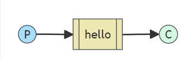

# Ejercicio RabbitMQ1

En este ejercicio se utiliza un patron de encolamiento sencillo, utilizando un consumidor, una cola y un producto.

## Explicacion
Se utiliza el uso de perfiles para activar el envio, suscripcion de mensajes.

Se creo la clase Tut1Config para configurar a nivel de memoria la cola Queue("Hello").

Tambien se configuro un consumidor @RabbitListener(queues = "hello").



## Archivo properties

```spring-boot-properties-yaml
spring:
  profiles:
    active: usage_message

  rabbitmq:
    username: admin
    password: admin

logging:
  level:
    org: ERROR

tutorial:
  client:
    duration: 10000
```


## Comandos para ejecutar
./gradlew clean build
java -jar build/libs/example_rabbit-0.0.1-SNAPSHOT.jar --spring.profiles.active=hello-world,receiver
java -jar build/libs/example_rabbit-0.0.1-SNAPSHOT.jar --spring.profiles.active=hello-world,sender


