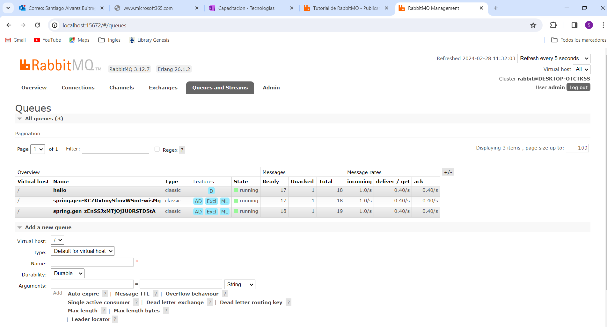

# Ejercicio RabbitMQ1
https://www.rabbitmq.com/tutorials/tutorial-three-spring-amqp 

 

A diferencia del ejemplo anterior que el productor se conectaba directamente con la cola, en este ejemplo enfocados un poco más a la realidad creamos un exchange que recibe los mensajes y los manda a las colas 
 
El exchange que se crea es de tipo fanount, distribuye a todas las colas que existan sin imporar el routingKey. 

Para este ejemplo se crearon dos colas temporales + la cola por defecto hello, adicional se agrego 3 métodos de configuración bean para enlazar las colas con el Exchange fanout, para el consumidor se colocó 3 métodos que están escuchando cada cola y manejan los mensajes que llegan. 

 

## Explicacion

P -> Productor 
C -> Consumidor 1...* 
Cola -> Cola 
X -> Exhange 


## Archivo properties

```spring-boot-properties-yaml
spring:
  profiles:
    active: usage_message

  rabbitmq:
    username: admin
    password: admin

logging:
  level:
    org: ERROR

tutorial:
  client:
    duration: 10000
```


## Comandos para ejecutar

Se debe ejecutar primero el receiver y al mismo tiempo el sender

./gradlew clean build
java -jar build/libs/rabbitmq_exercises3-0.0.1-SNAPSHOT.jar --spring.profiles.active=pub-sub,sender     --tutorial.client.duration=60000
java -jar build/libs/rabbitmq_exercises3-0.0.1-SNAPSHOT.jar --spring.profiles.active=pub-sub,sender     --tutorial.client.duration=60000




