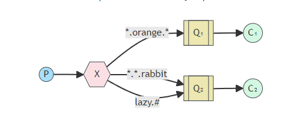
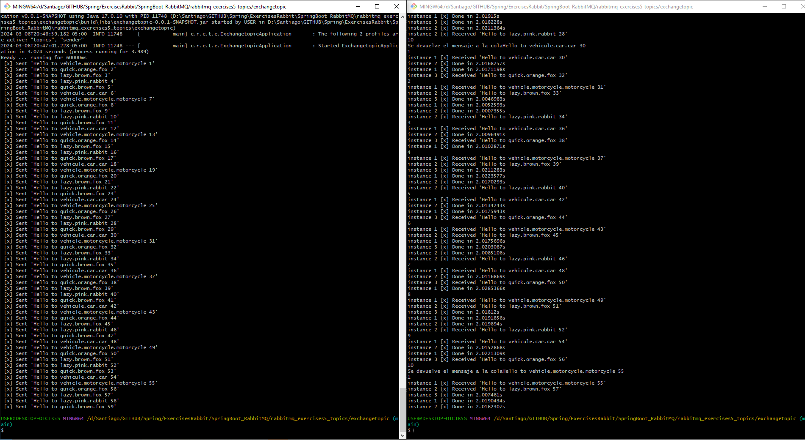
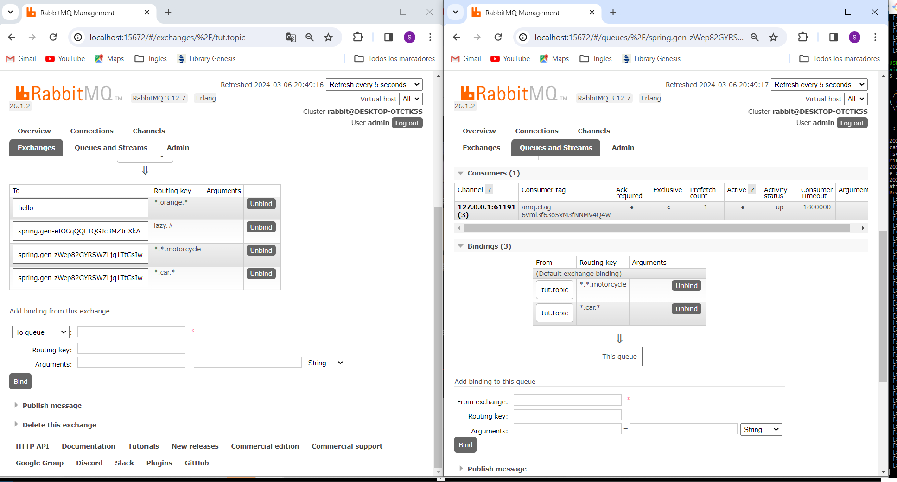

# Ejercicio RabbitMQ4
https://www.rabbitmq.com/tutorials/tutorial-four-spring-amqp 

A diferencia del ejemplo anterior, creamos varios bindings que se conectan entre la cola y el exchange, pero esta vez de tipo topic creamos patrones para que la cola envie a diferentes routingKey
adicional al ejemplo se agrego *.car* y *.*.mothorcicle


## Explicacion

```
P -> Productor 
C -> Consumidor 1...* 
Cola -> Cola 
X -> Exhange (Direct)
```
Se agrego la funcionalidad cuando algo falle devuelve automaticamente a la cola



## Archivo properties

```spring-boot-properties-yaml
spring:
  profiles:
    active: usage_message

  rabbitmq:
    username: admin
    password: admin

logging:
  level:
    org: ERROR

tutorial:
  client:
    duration: 10000
```


## Comandos para ejecutar

Se debe ejecutar primero el receiver y al mismo tiempo el sender

./gradlew clean build
java -jar build/libs/exchangetopic-0.0.1-SNAPSHOT.jar --spring.profiles.active=topics,sender     --tutorial.client.duration=60000
java -jar build/libs/exchangetopic-0.0.1-SNAPSHOT.jar --spring.profiles.active=topics,receiver     --tutorial.client.duration=60000






