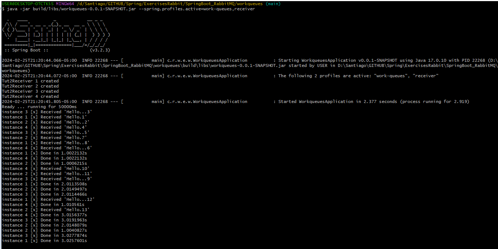

# Ejercicio RabbitMQ1

En este ejemplo se escribió un programa que envía y recibe mensajes de una cola, la diferencia con el primer ejemplo es que esta vez tendremos más de un consumidor activo. 

## Explicacion

P -> Productor 
C -> Consumidor 1...* 
Cola -> Cola 


## Archivo properties

```spring-boot-properties-yaml
spring:
  profiles:
    active: usage_message

  rabbitmq:
    username: admin
    password: admin

logging:
  level:
    org: ERROR

tutorial:
  client:
    duration: 10000
```


## Comandos para ejecutar

./gradlew clean build 
java -jar build/libs/workqueues-0.0.1-SNAPSHOT.jar --spring.profiles.active=work-queues,receiver
java -jar build/libs/workqueues-0.0.1-SNAPSHOT.jar --spring.profiles.active=work-queues,sender





